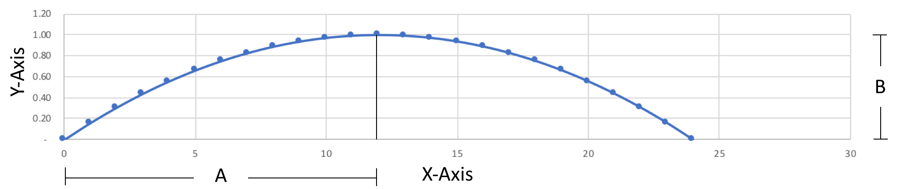

# arc_tool

The arc_tool is used to calculate the measurements when drawing an arc on a piece of wood.  Given a depth "B" and a length "A" (see diagram below), it will calculate the Y-Axis values for a set of X-Axis values.

